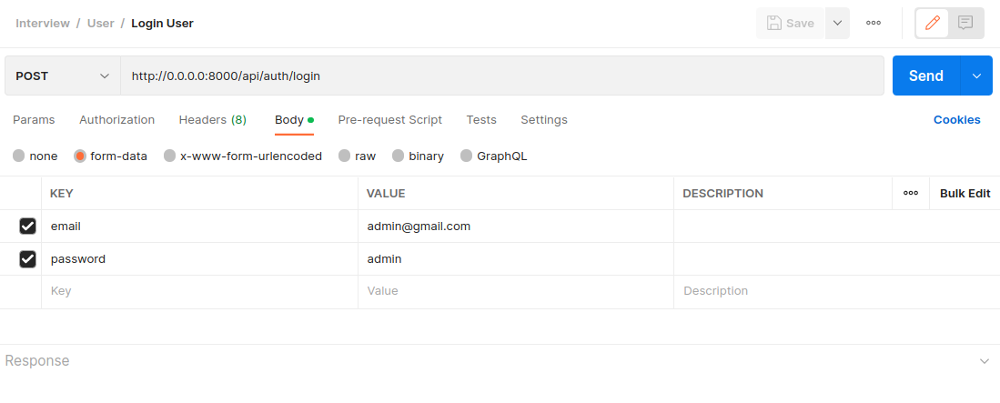
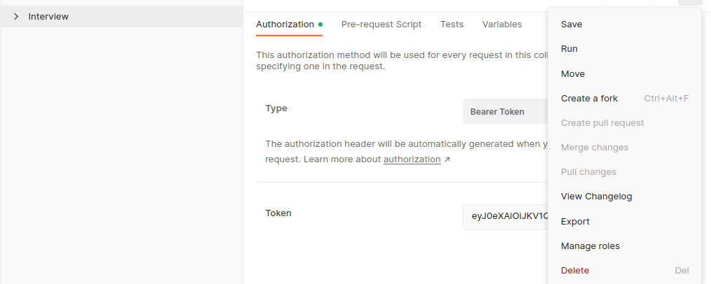

# Getting started

Clone the repository:

    git clone git@github.com:alekspetrovv/spinnov-api.git

Switch to the repo folder:

    cd spinnov-api

Copy the example env file and make the required configuration changes in the .env file:

    cp .env.example .env

Building docker containers:

    docker compose up --build -d
    OR
    docker-compose up --build -d

Run the composer install:

    docker-compose exec php composer install
    OR
    docker compose exec php composer install

Run the database migrations:

    docker-compose exec php php artisan migrate
    OR
    docker compose exec php php artisan migrate

Run the database seeds:

    docker-compose exec php php artisan db:seed
    OR
    docker compose exec php php artisan db:seed

Generate personal access tokens:

    docker-compose exec php php artisan passport:install
    OR
    docker compose exec php php artisan passport:install

Start the local development server

    docker-compose exec php php artisan serve --host=0.0.0.0
    OR
    docker compose exec php php artisan serve --host=0.0.0.0

You can now access the server at http://0.0.0.0:8000/

### Entity Relationship Diagram

## Endpoints

#### Auth controller

| URL                | Function              | Type |  
|--------------------|-----------------------|:----:|
| /api/auth/register | Register User         | POST |
| /api/auth/login    | Retrieve Bearer Token | POST |

#### Sensors controller

| URL                | Function         | Type |   Roles    |
|--------------------|------------------|------|:----------:|
| /api/sensors/sync  | Create Sensors   | POST | Admin,User |
| /api/sensors       | Retrieve Sensors | GET  | Admin,User |

#### Devices controller

| URL               | Function          |  Type  |    Roles    |
|-------------------|-------------------|--------|:-----------:|
| /api/devices      | Create device     |  POST  | Admin, User |       
| /api/devices/{id} | Update device     |  PUT   | Admin, User |
| /api/devices      | Retrieve devices  |  GET   |    User     |
| /api/devices/{id} | Retrieve device   |  GET   |    User     |
| /api/devices/{id} | Delete device     | DELETE | Admin,User  |

## Postman Setup

##### There is already existing user with an admin role, hence you can already use it to test the requests:

#### When token is retrieved you can use it to set the auth for every request:

### You can test the api-calls from this url:
https://app.getpostman.com/join-team?invite_code=2289c5b087391a377cc8029e2b0d9763&target_code=30700ad5f95a6bef59a9edb1d8b5931a

### Features Completed
    -> Device management (create, update, read and delete)
    -> User authentication. 
    -> Store sensor data per device.
    -> Database structure.
    + Role Based Authentication
    + Input Validation

